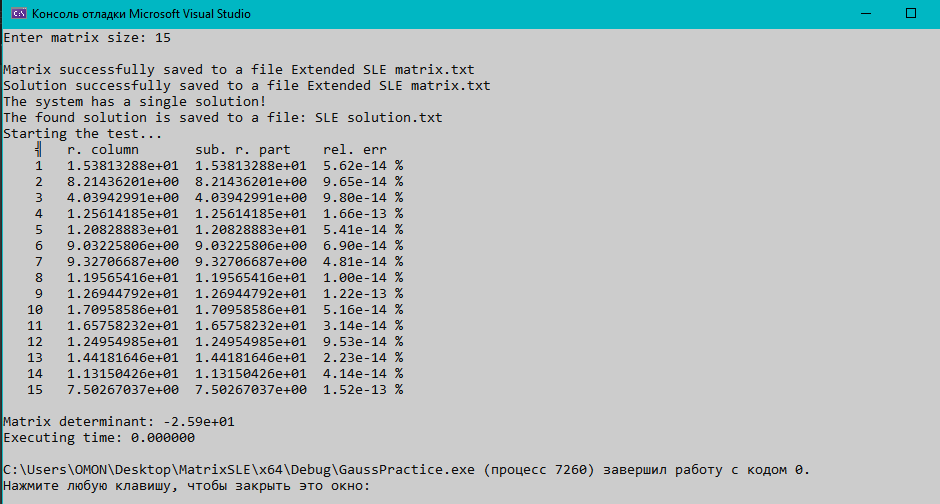
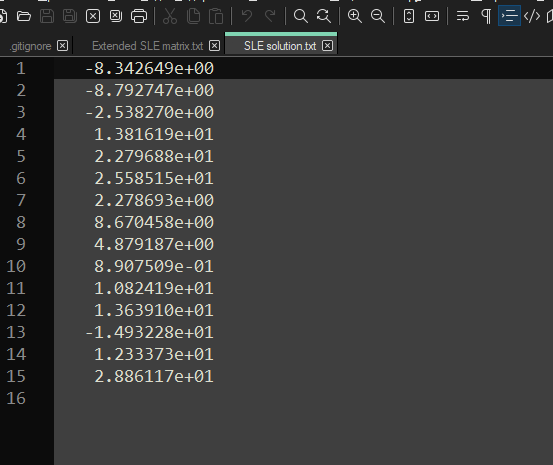
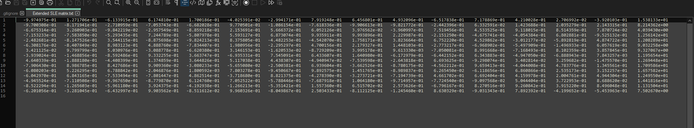

 

  <h3 align="center">Matrix SLE</h3>

  

    <a href="https://github.com/EmcTROJ1N/MatrixSLE/">View Demo</a>
    ·
    <a href="https://github.com/EmcTROJ1N/MatrixSLE/issues">Report Bug</a>
    ·
    <a href="https://github.com/EmcTROJ1N/MatrixSLE/issues">Request Feature</a>
  

<!-- TABLE OF CONTENTS -->

  
Table of Contents

  <ol>
    <li>
      <a href="#about-the-project">About The Project</a>
      <ul>
        <li><a href="#built-with">Built With</a></li>
      </ul>
    </li>
    <li>
      <a href="#getting-started">Getting Started</a>
      <ul>
        <li><a href="#prerequisites">Prerequisites</a></li>
        <li><a href="#installation">Installation</a></li>
      </ul>
    </li>
    <li><a href="#usage">Usage</a></li>
    <li><a href="#contributing">Contributing</a></li>
    <li><a href="#contact">Contact</a></li>
    <li><a href="#acknowledgments">Acknowledgments</a></li>
  </ol>

<!-- ABOUT THE PROJECT -->
## About The Project

This project is a C++ program for solving systems of algebraic linear equations. It includes functions for calculating matrix determinants, relative error, solving the matrix, and generating/exporting matrices to files.

(<a href="#readme-top">back to top</a>)

### Built With

<!-- GETTING STARTED -->

## Work Examples:

### Console output:

### Exported solution:

### Exported matrix:

<!-- CONTRIBUTING -->
## Contributing

Contributions are what make the open source community such an amazing place to learn, inspire, and create.

If you have a suggestion that would make this better, please fork the repo and create a pull request. You can also simply open an issue with the tag "enhancement".
Don't forget to give the project a star! Thanks again!

<ol>
  <li>Fork the Project</li>
  <li>Commit your Changes (`git commit -m 'Add some AmazingFeature'`)</li>
  <li>Push to the Branch (`git push origin feature/AmazingFeature`)</li>
  <li>Open a Pull Request</li>
</ol>

(<a href="#readme-top">back to top</a>)

<!-- CONTACT -->
## Contact

Your Name - [@pokrov1970](https://t.me/pokrov1970) - 19et72@mail.ru

[Project Link](https://github.com/EmcTROJ1N/MatrixSLE)

(<a href="#readme-top">back to top</a>)

